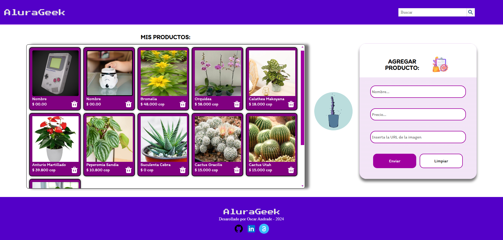
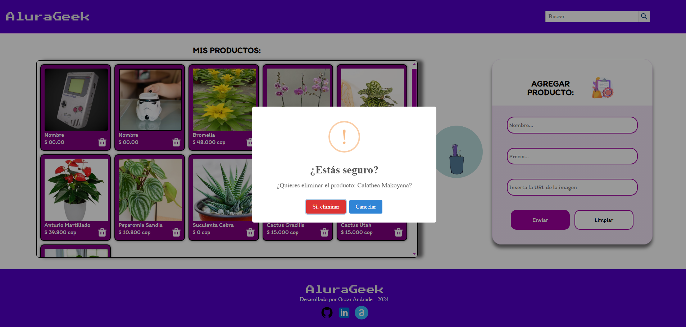
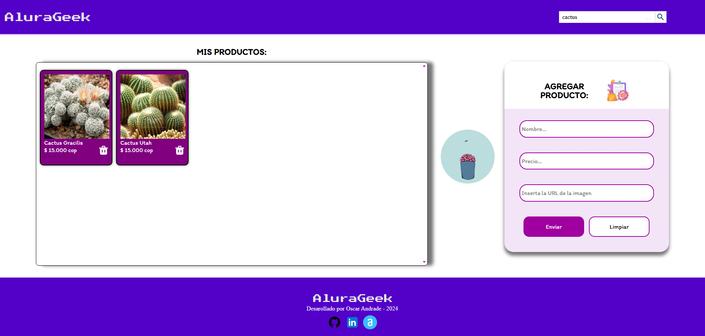
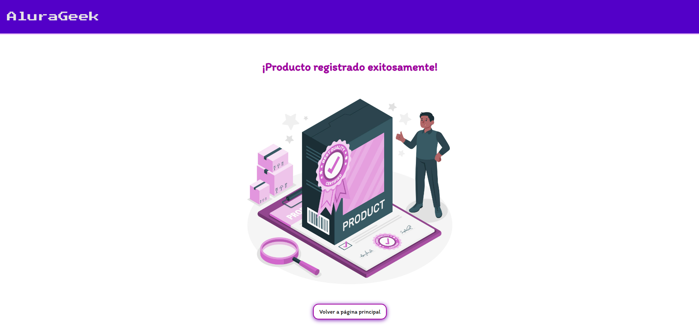

# Challenge ONE | Front End

<p align="center" >
     
</p>

# <h1 align="center"><strong>¡AluraGeek Oscar Andrade!</strong></h1> 
---

## Descripción del proyecto📋

Este Challenger tiene como objetivo el manejo de modulos utilizando JSON Server que simula una API REST a partir de un archivo JSON. Permite desarrollar y probar aplicaciones frontend sin necesidad de una API real. Facilita la creación rápida de endpoints para realizar operaciones CRUD y simular respuestas de servidor, lo que agiliza el desarrollo de aplicaciones web. Es útil para prototipado rápido, pruebas de concepto y desarrollo frontend independiente del backend.:

>```
> CRUD:
>       🔹Crear. 
>       🔹Leer. 
>       🔹Actualizar. 
>       🔹Eliminar.
>```

## Modo de uso📌

### Base de datos **json-server**

Para cargar la base de datos de json-server de manera local, debe ejecutar en una terminal el siguiente comando, y así podrá visualizar en pantalla los productos:

>```
> npx json-server --watch db.json --port 3001
>```

Sin embargo, en este link podrá visualizar en linea el demo del proyecto con los productos cargados ya que está la base de datos en Mockapi:

https://alura-geek-oscar-andrade.vercel.app/

---
### Eliminar un producto

En la parte inferior derecha de la tarjeta del producto, se podrá ver el icono de  que selelccionado activará la ventana de eliminar producto, y al confirmar procede a ejecutar la acción.



### Buscar un producto

En la parte superior derecha de la página se encuentra la caja de búsqueda donde podrá traer en pantalla el producto solicitado por su nombre.



### Agregar un producto

En la sección `AGREGAR PRODUCTO` de la página tenemos un formulario con 3 campos requeridos para la creación e ingreso de un producto con *Nombre*, *Precio*, *Imagen*, y al dar click al botón `Enviar`, se cargará el nuevo producto y se redireccionará a la página de confirmación de registro exitoso. 



## Modo Responsivo🔍

Para dispositivos con pantalla menores y mayores a `768px`.

---
## Tecnologías utilizadas💡

- 
- 
- 
- 
- 
---
## Desarrollador del Proyecto👨‍💻

<h1 align="center"><strong>Oscar Eduardo Andrade Reyes</strong></h1>

<div align="center">
<table>
  <tr>
    <td></td>
    <td></td>
  </tr>
</table>
</div>